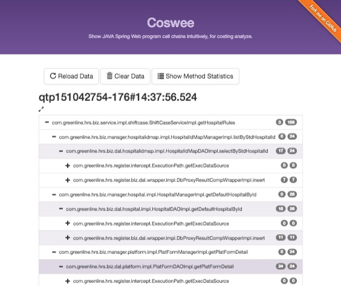
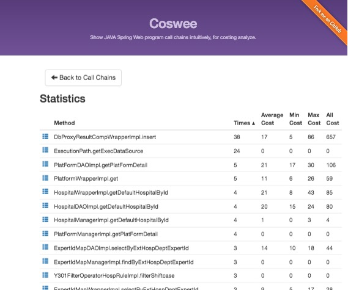
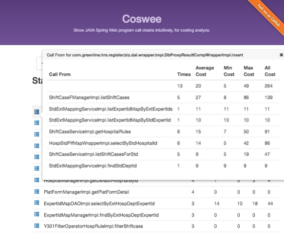

# coswee
show the program call chains intuitively, for costing analyze

- threads stack detail(times,cost)
- 
- call statistics
- 
- call from
- 

*****

# Hot to use
##### add dependency
<pre><code>
    &lt;dependency&gt;
        &lt;groupId&gt;com.github.xuqiu&lt;/groupId&gt;
        &lt;artifactId&gt;coswee&lt;/artifactId&gt;
        &lt;scope&gt;test&lt;/scope&gt;
    &lt;/dependency&gt;
</code></pre>

##### for junit case

<pre><code>    @Test
    public void testSynShiftcaseTask(){
        synShiftcaseTask.synShiftcaseTask("SKPT");
        CallChainServlet.writePage("/Users/yinzhennan/temp/tmpPage.html");
    }</code></pre>
    
##### for web project case
- add servlet to web.xml
<pre><code>    &lt;servlet&gt;
        &lt;servlet-name&gt;CosweeServlet&lt;/servlet-name&gt;
        &lt;servlet-class&gt;com.github.xuqiu.coswee.servlet.CallChainServlet&lt;/servlet-class&gt;
    &lt;/servlet&gt;
    &lt;servlet-mapping&gt;
        &lt;servlet-name&gt;CosweeServlet&lt;/servlet-name&gt;
        &lt;url-pattern&gt;/coswee/*&lt;/url-pattern&gt;
    &lt;/servlet-mapping&gt;</code></pre>
##### spring config
<pre><code>    &lt;!-- aop config --&gt;
    &lt;aop:aspectj-autoproxy/&gt;
    &lt;bean id=&quot;orderCheckInterceptor&quot; class=&quot;com.github.xuqiu.coswee.aspect.CallChainAspect&quot;/&gt;</code></pre>